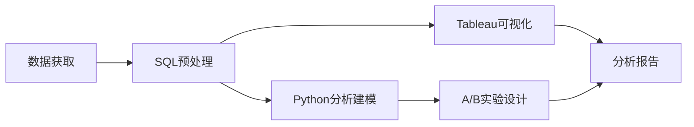

以下是一个**整合SQL、Tableau、Python和A/B实验设计的完整项目框架**，使用真实开源数据，可直接落地执行：

---

### **项目名称：电商广告策略效果评估与优化**  

**数据集**：Kaggle电商A/B测试数据集  
🔗 [https://www.kaggle.com/datasets/faviovaz/marketing-ab-testing](https://www.kaggle.com/datasets/faviovaz/marketing-ab-testing)  

---

### **项目架构**



---

### **一、SQL数据预处理**

```sql
-- 计算各组转化率
SELECT 
  test_group,
  COUNT(*) AS total_users,
  SUM(CASE WHEN converted = 'True' THEN 1 ELSE 0 END) AS converted_users,
  ROUND(SUM(CASE WHEN converted = 'True' THEN 1 ELSE 0 END) * 100.0 / COUNT(*), 2) AS conversion_rate
FROM marketing_ab
GROUP BY test_group;

-- 广告曝光量与转化率的关系
WITH bins AS (
  SELECT
    user_id,
    converted,
    total_ads,
    CASE
      WHEN total_ads <= 50 THEN '0-50'
      WHEN total_ads <= 100 THEN '51-100'
      WHEN total_ads <= 200 THEN '101-200'
      ELSE '200+'
    END AS ads_bucket
  FROM marketing_ab
  WHERE test_group = 'ad' -- 仅分析实验组
)
SELECT
  ads_bucket,
  COUNT(*) AS users,
  SUM(CASE WHEN converted = 'True' THEN 1 ELSE 0 END) AS conversions,
  ROUND(SUM(CASE WHEN converted = 'True' THEN 1 ELSE 0 END) * 100.0 / COUNT(*), 2) AS conversion_rate
FROM bins
GROUP BY ads_bucket
ORDER BY 
  CASE ads_bucket
    WHEN '0-50' THEN 1
    WHEN '51-100' THEN 2
    WHEN '101-200' THEN 3
    ELSE 4
  END;
-- 星期几的转化效果
SELECT 
  most_ads_day,
  COUNT(*) AS impressions,
  ROUND(AVG(CASE WHEN converted = 'True' THEN 1 ELSE 0 END) * 100, 2) AS conversion_rate
FROM marketing_ab
WHERE test_group = 'ad'
GROUP BY most_ads_day
ORDER BY 
  CASE most_ads_day
    WHEN 'Monday' THEN 1
    WHEN 'Tuesday' THEN 2
    WHEN 'Wednesday' THEN 3
    WHEN 'Thursday' THEN 4
    WHEN 'Friday' THEN 5
    WHEN 'Saturday' THEN 6
    WHEN 'Sunday' THEN 7
  END;

-- 小时段的转化效果
SELECT 
  most_ads_hour,
  COUNT(*) AS impressions,
  ROUND(AVG(CASE WHEN converted = 'True' THEN 1 ELSE 0 END) * 100, 2) AS conversion_rate
FROM marketing_ab
WHERE test_group = 'ad'
GROUP BY most_ads_hour
ORDER BY most_ads_hour;

```

---

### **二、Python统计检验**

#### 1. AB测试转化率差异检验（两样本比例Z检验）

- 用于比较两个独立样本的比例是否有显著差异
- 基于正态分布近似，计算Z统计量：

$$
Z = \frac{p_1 - p_2}{\sqrt{p_{\text{pool}}(1 - p_{\text{pool}}) \left(\frac{1}{n_1} + \frac{1}{n_2}\right)}}
$$

$$
其中：

{\text{pool}} = \frac{x_1 + x_2}{n_1 + n_2}
$$

- 当样本量足够大（n>30）且np和n(1-p)都大于5时有效

#### 2. 广告曝光量分桶转化率差异检验（卡方检验）

- 检验多个组间分类变量的分布是否相同

- 计算观察频数与期望频数的差异：
  $$
X^2 = \sum \frac{(O_i - E_i)^2}{E_i} \quad \text{自由度} =  (行数-1)(列数-1)
Cramér’s V（效应量）：V = \sqrt{ \frac{X^2}{n(k - 1)} }
  $$


#### 3. 星期几转化率差异检验（卡方检验）

  - 同卡方检验原理，检验分类变量（星期几）与二元结果（转化）是否独立

#### 4. 小时段转化率差异检验（卡方检验）

  - 同卡方检验原理，检验分类变量（小时）与二元结果（转化）是否独立

#### 5. 广告曝光量与转化率的相关性分析（Pearson相关）

$$
r= \frac{ \sum (x_i - \bar{x})(y_i - \bar{y}) }{ \sqrt{ \sum (x_i - \bar{x})^2 \sum (y_i - \bar{y})^2 } }
$$


  - 衡量两个连续变量间的线性相关程度

    

### **三、Tableau可视化**


